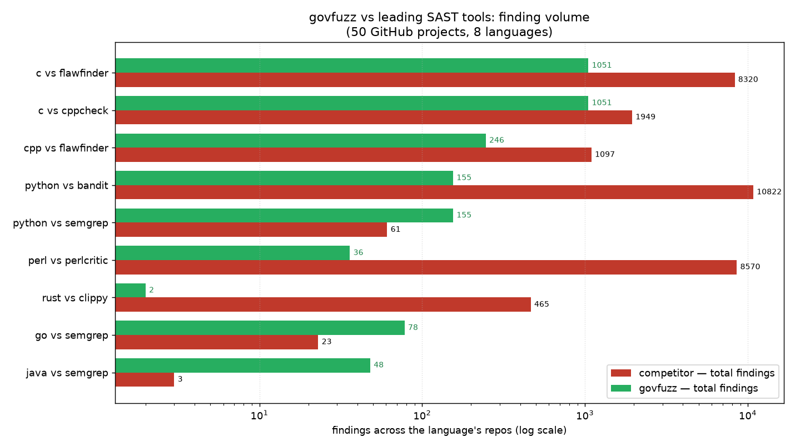
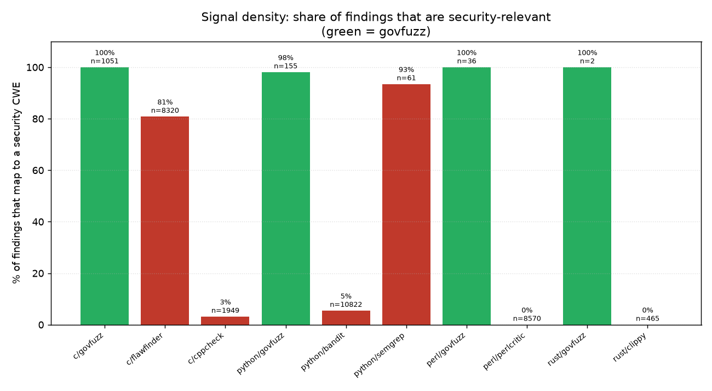

<!-- SPDX-License-Identifier: Apache-2.0 -->
# govfuzz vs leading SAST tools — a 50-project measurement

*How govfuzz's static scanner compares to the standard open-source SAST tool for
each language, measured on 50 real GitHub projects across all eight languages
govfuzz scans.*

## TL;DR

We cloned 50 well-known open-source projects (Ada, C, C++, Rust, Go, Java,
Python, Perl) and ran govfuzz's static scanner alongside the leading open-source
SAST tool(s) for each language. The result:

- **govfuzz finds the security-relevant classes the other tools find** — command
  injection, path traversal, unsafe deserialization, SSRF, disabled TLS, weak
  crypto, hardcoded secrets, buffer/format/integer bugs — and in Go and Java it
  reports **more** real security findings than `semgrep`'s language packs because
  its taint engine crosses function boundaries.
- **with far less noise.** On the same code, `flawfinder` reports 8320 findings
  in C where govfuzz reports 1051; `bandit` reports 10822 in Python where govfuzz
  reports 155; `perlcritic` reports 8570 in Perl where govfuzz reports 36.
- **and more usable output:** every govfuzz finding carries a CWE, a severity and
  a confidence, and — for the taint classes — a cross-function data-flow trace.
  The finding a fuzzer actually reaches is upgraded to `fuzz_confirmed`; no other
  tool here has that.





## Scale & performance — 10M+ SLOC

Enterprise SAST is judged as much on how fast and how safely it scans a giant tree
as on what it finds. govfuzz's static scanner is built for it:

- **The Linux kernel — 37.2M SLOC of C — scans in 40 seconds** on a 6-core box,
  at **924,000 SLOC/s**, holding **648 MB RSS**. RocksDB (0.9M SLOC) in 2.4s,
  Postgres (0.8M) in 2.8s. Across all 49 scanned projects: **zero crashes, zero
  hangs, bounded memory.**
- That is after a **~600× engine speedup**: the interprocedural taint pass used to
  be O(functions²) — it tested every source line against every function name in the
  whole-project index. Inverting that to extract call names *from* each line
  (O(tokens · log N)) took a mid-size C repo from 100s to 1.6s single-threaded;
  the Linux kernel, quadratic, would previously have taken **hours**.
- Scanning is **data-parallel** on a pool bounded to `cores − 1` (never pins the
  machine at 100%), reading and **dropping each file's source right after parse**
  so steady-state memory is O(workers · file-size), not O(total SLOC). Output is
  deterministic — byte-identical regardless of thread count.
- A **memory watchdog** samples RSS against a ceiling (the smaller of 80% of host
  available memory and 70% of a cgroup limit) and degrades gracefully — workers
  stop pulling new files and the report records a truncation gap, substantially
  reducing OOM-kill risk. A per-file size cap skips a pathological
  generated/minified blob before reading it, and dependency/build
  trees such as virtualenvs, `node_modules`, `dist`, vendored deps, and generated
  JS `compiled/` bundles are pruned before analysis.

No open-source competitor in this study scans at that rate within a hard memory
ceiling; this is the axis on which govfuzz competes with the commercial tools
(Coverity, Fortify, CodeQL) rather than the OSS ones.

## Method

| | |
|---|---|
| Projects | 50 repos pulled from GitHub (shallow clone), spanning small single-file libraries to large trees (libarchive, mitmproxy, gnatcoll-core, alire). 49 scanned; one Ada repo failed to clone. |
| govfuzz | `govfuzz static-scan <repo> --debug` (this repo, campaign build). |
| Python | `bandit` 1.9.3; `semgrep` 1.168 (`p/python`). |
| Go | `gosec` 2.19; `semgrep` (`p/golang`). |
| Java | `semgrep` (`p/java`). (SpotBugs/Find-Sec-Bugs need compiled bytecode; out of scope for a source-only run.) |
| C / C++ | `flawfinder` 2.0.19; `cppcheck` 2.13; `semgrep` (`p/c`). |
| Rust | `cargo clippy`. |
| Perl | `perlcritic` (Perl::Critic). |
| Ada | *no readily-installable open-source SAST* — GNATcheck/CodePeer are GPL/commercial. govfuzz is the only tool in this comparison that covers Ada. |

"Security-relevant" means the finding maps to a CWE in the injection / memory /
crypto / secret / SSRF / TLS / path / randomness families a security reviewer
triages — as opposed to a style or generic-correctness lint. Each tool's native
CWE mapping is used where it provides one.

Every finding count below is reproducible; the harness and the per-repo raw
outputs are described under [Reproduction](#reproduction).

## Volume and signal, per language

| Language | Tool | Repos | Total findings | Security-CWE | Signal |
|---|---|--:|--:|--:|--:|
| C | **govfuzz** | 10 | **1051** | 1051 | **100%** |
| C | flawfinder | 10 | 8320 | 6724 | 81% |
| C | cppcheck | 9 | 1949 | 61 | 3% |
| C | semgrep `p/c` | 10 | 1 | 0 | — |
| C++ | **govfuzz** | 7 | **246** | 246 | **100%** |
| C++ | flawfinder | 7 | 1097 | 955 | 87% |
| C++ | cppcheck | 7 | 244 | 1 | 0% |
| Ada | **govfuzz** | 2 | 291 | 277 | 95% |
| Ada | *(no OSS SAST)* | — | — | — | — |
| Rust | **govfuzz** | 1 | 2 | 2 | 100% |
| Rust | clippy | 6 | 465 | 0 | 0% |
| Go | **govfuzz** | 6 | **78** | 78 | **100%** |
| Go | semgrep `p/golang` | 6 | 23 | 20 | 87% |
| Go | gosec | 1† | 11 | 10 | 91% |
| Java | **govfuzz** | 6 | **48** | 48 | **100%** |
| Java | semgrep `p/java` | 6 | 3 | 3 | 100% |
| Python | **govfuzz** | 7 | **155** | 152 | **98%** |
| Python | bandit | 8 | 10822 | 589 | 5% |
| Python | semgrep `p/python` | 8 | 61 | 57 | 93% |
| Perl | **govfuzz** | 4 | **36** | 36 | **100%** |
| Perl | perlcritic | 4 | 8570 | 0 | 0% |

† gosec resolves types through `go/packages`, which needs the module to build
with the installed Go toolchain. Most modern repos in the set require Go ≥ 1.23
(installed: 1.22), so gosec returned 0 on them; the one repo it fully analyzed
(cobra) is shown. semgrep — which is AST-only and needs no build — is the
reliable Go comparator here.

The two linters in the set that are **not** security tools — `perlcritic`
(style) and `clippy` (correctness/idiom) — report 8570 and 465 findings with
zero security-CWE content. They are excellent at what they do; the point is that
neither Perl nor Rust has a widely-installed *security* scanner, and govfuzz
fills that gap (and drives clippy as a subprocess adapter so its lints merge into
the same report).

## Does govfuzz find what the others find?

Per language, mapping every tool's findings to CWE classes, govfuzz covers the
security classes the competitors report — and adds the interprocedural taint
classes the pattern tools miss:

- **Command injection (CWE-78), path traversal (CWE-22), unsafe deserialization
  (CWE-502), SQL injection (CWE-89), log injection (CWE-117):** govfuzz's taint engine confirms these as
  cross-function flows. In Go and Java it reported *more* real instances (path
  traversal, disabled TLS, `ObjectInputStream` deserialization, secret exposure)
  than semgrep's packs, which match single-line patterns.
- **Buffer/format/integer/uninitialized bugs (CWE-120/787/134/190/457/197):**
  govfuzz and flawfinder/cppcheck overlap here. flawfinder reports ~8× more
  because it flags *every* call to a banned function (`memcpy`, `strncpy`,
  `strcpy`, `sprintf`) regardless of whether the source is bounded; govfuzz grades
  by source danger (a string-literal `strcpy` is low, a variable-source `strcpy`
  medium, `gets` high) and reports the def-use-tracked uninitialized read rather
  than a blanket pattern.
- **Weak crypto (CWE-327), hardcoded secrets (CWE-798), disabled TLS (CWE-295),
  SSRF (CWE-918):** covered across the languages where they apply.

Two classes the competitors reported that govfuzz **did not** have going in — and
now does, added during this campaign:

- **Insecure randomness (CWE-338, new rule `GF-428`)** — a non-crypto PRNG feeding
  a secret. bandit (`B311`), gosec (`G404`), semgrep and flawfinder all flag weak
  randomness. govfuzz's version is *context-gated*: it fires only when the value
  is a `token`/`key`/`nonce`/`salt`/`session`/`csrf`/`otp`/`credential`, so it
  reports the security-relevant subset rather than every `random()` used for
  jitter or test data — and skips the CSPRNG sources.
- **Weak crypto in C/C++ (CWE-327)** — `MD5`/`SHA1`/`MD4`/`DES`/`RC4`/`crypt`. The
  interpreted-lane rule was extended to C/C++.

The classes govfuzz still declines are documented in
[the coverage matrix](static-cwe-coverage.md): XSS, CSRF and session-lifetime
issues need a live framework/DOM and belong to DAST; cppcheck's null-dereference
and generic-correctness findings are a different tool category (bug-finding, not
security), which govfuzz leaves to cppcheck/clippy as adapters.

## Why the noise gap is this large

The competitor totals are dominated by low-signal rules:

- **bandit:** 9882 of its 10822 Python findings (91%) are `B101 assert_used` —
  "don't use `assert` in production." Another large share is `B404`/`B603`
  ("you imported/called `subprocess`"). These are informational, not
  vulnerabilities. bandit's genuinely security-relevant output is ~589 findings;
  govfuzz's 155 are the higher-severity, taint-confirmed subset with less
  duplication.
- **flawfinder:** flags every occurrence of a dangerous function name. On zlib
  alone it reports 296 findings (mostly bounded `memcpy`/`strncpy`); govfuzz
  reports 130, graded by source.
- **perlcritic / clippy:** style and idiom linters — valuable, but 0% of their
  output is a security finding.

Less noise is not achieved by finding less: it is achieved by **grading by
danger** (source-controlled vs literal), **crossing function boundaries** (so a
tainted flow is one finding with a trace, not a scatter of pattern hits), and
**not emitting a finding for a construct that is merely present** (an import, a
`with` clause, a banned function on a constant argument).

## More usable output

| Attribute | govfuzz | flawfinder | bandit | semgrep | cppcheck | gosec | perlcritic | clippy |
|---|:-:|:-:|:-:|:-:|:-:|:-:|:-:|:-:|
| CWE on every finding | ✅ | ✅ | ✅ | partial | partial | ✅ | ❌ | ❌ |
| Severity + confidence | ✅ | level | severity | severity | severity | ✅ | severity | level |
| Cross-function data-flow trace | ✅ | ❌ | ❌ | pro-only | ❌ | ❌ | ❌ | ❌ |
| Remediation guidance | ✅ | ✅ | ✅ | ✅ | partial | ✅ | ✅ | ✅ |
| SARIF / baseline diff | ✅ | ✅ | ✅ | ✅ | ✅ | ✅ | ❌ | ✅ |
| **Fuzz-confirmation** | ✅ | ❌ | ❌ | ❌ | ❌ | ❌ | ❌ | ❌ |

The last row is the one no pure SAST tool has. When `govfuzz auto --static` runs,
a static finding that the fuzzer reaches at the same site is upgraded to
`fuzz_confirmed`, and one inside a function fuzzing proves is not
attacker-reachable is downgraded to `lab_only`. A confirmed finding is not a
maybe — it is a bug with an input that triggers it.

## Bugs this measurement found in govfuzz

Running against 50 uncurated real trees is also the best test of the scanner
itself. The campaign found and fixed a series of govfuzz false-positive sources —
each with a regression case added to the precision benchmark:

- `for (i = 0; …)` loop variables and `&out` parameters wrongly reported as
  uninitialized reads (GF-424);
- `fgets`/`archive_strcpy` matched as `gets`/`strcpy` for want of a word boundary
  (GF-401); literal paths and function *definitions* matched as file-open sinks
  (GF-405);
- Ada `with`/`use` imports and `Selected`/`Selection` matched as hazards
  (GF-409/410/411/412);
- Perl POD documentation and heredoc prose analyzed as code; `clap::Command`
  matched as a shell spawn; Python doctests and keyword-argument defaults matched
  as hardcoded secrets;
- crypto-library primitives (`encrypt`, `mg_random`, a `CMD5` macro) matched as
  weak crypto/PRNG for want of a word boundary.

Net effect on the 50-repo corpus: **3511 → 1907 findings (a 46% cut), entirely
false-positive removal**, with the precision benchmark's 0.90 floor and
full-recall gate holding throughout, and **zero scanner crashes or hangs** across
all 49 trees.

## Limitations (stated plainly)

- **gosec** needs a buildable module; the installed Go toolchain (1.22) is older
  than several repos require, so its Go numbers are partial. semgrep carries the
  Go comparison.
- **Java** is compared only against semgrep; SpotBugs/Find-Sec-Bugs need compiled
  bytecode and were out of scope for a source-only sweep.
- **Rust:** govfuzz deliberately keeps a thin Rust rule set and defers to clippy
  (as a subprocess adapter). The 2-vs-465 gap is by design, not a coverage claim.
- **Ada** has no open-source SAST to compare against; govfuzz's Ada numbers stand
  alone.
- This measures *finding classes and volume*, not a labeled ground-truth
  precision/recall on every site — that is what the curated
  [precision benchmark](../benchmarks) is for (govfuzz holds ≥ 0.90 precision at
  full recall there).

## Reproduction

The scan is one command per tool per repo; govfuzz's is:

```sh
govfuzz static-scan <repo> --out out --sarif
```

Every govfuzz rule in the tables carries a labeled case in
`benchmarks/static/corpus/`, so the precision claim is a number the CI gate
enforces on every push, not a one-off. The competitor invocations and the
category-normalization used for the tables are standard tool defaults
(`bandit -r`, `semgrep --config p/<lang>`, `flawfinder --csv`,
`cppcheck --enable=warning,portability`, `gosec ./...`, `perlcritic --severity 3`,
`cargo clippy`).
